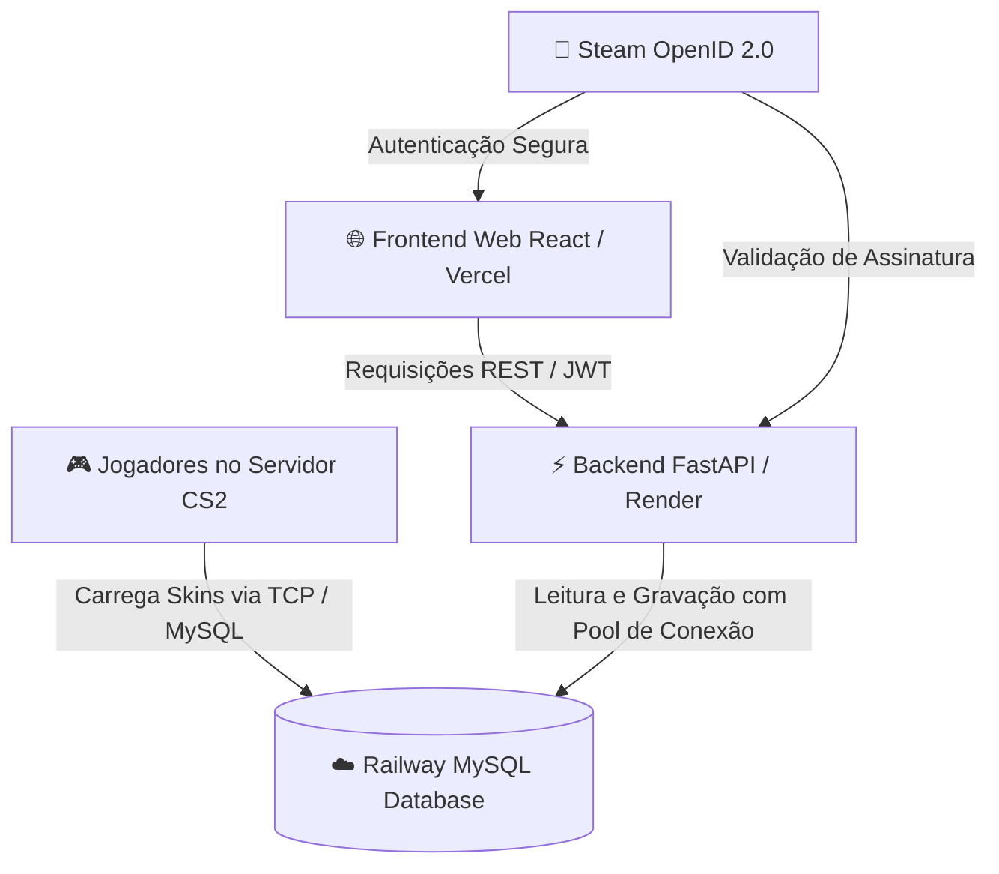

# 🎮 CS2 WeaponPaints Web — Plataforma de Gerenciamento de Skins & Inventário

> **Full-Stack Web Platform & Game Server Integration**  
> Interface moderna, responsiva e de alta performance desenvolvida para seleção, personalização e sincronização em tempo real de skins, facas, luvas e agentes no **Counter-Strike 2**, integrada diretamente ao ecossistema do plugin [CounterStrikeSharp / WeaponPaints](https://github.com/Nereziel/cs2-WeaponPaints) através de **MySQL em Nuvem**.

---

## 🚀 Demonstração da Arquitetura & Stack Tecnológica

O projeto foi projetado com uma arquitetura desacoplada e escalável, utilizando as melhores práticas modernas de desenvolvimento Web, DevOps e Engenharia de Banco de Dados:



---

### Interface


---


---


---


---


### 🛠️ Tecnologias & Plataformas Utilizadas:

* **Frontend:**
  * **React 18 + Vite:** Renderização ultra-rápida, Single Page Application (SPA) e gerenciamento de estado otimista.
  * **TailwindCSS + Custom Glassmorphism:** Interface *Dark Mode* tática com efeitos de profundidade, backdrop blur e tipografia temática oficial **Reversal** (*Typodermic Fonts*).
  * **Vercel:** Hospedagem com *Edge Network global*, deploy contínuo (CI/CD) e suporte a *SPA rewrite rules*.
* **Backend:**
  * **Python 3.11 + FastAPI:** API assíncrona de alta performance com tipagem rigorosa via **Pydantic v2** e documentação automática Swagger UI / OpenAPI.
  * **PyMySQL + Connection Management:** Pool de conexões otimizado para tolerância a falhas e atomicidade em operações de inventário.
  * **Autenticação Híbrida:** **Steam OpenID 2.0** oficial com geração de tokens seguros **JWT (JSON Web Tokens)** + suporte a **Dev Login** para testes locais.
  * **Render:** Deploy conteinerizado via **Docker** em infraestrutura *Cloud Web Service*.
* **Banco de Dados & Infraestrutura:**
  * **Railway MySQL:** Banco de dados relacional de alta concorrência com **TCP Proxy público** dedicado para conexões simultâneas de dezenas de jogadores e do servidor de jogo.
* **Integração com o Jogo (Source 2 / CS2):**
  * Protocolo de schemas compatível com **CounterStrikeSharp / WeaponPaints**.
  * Mapeamento minucioso dos **63 modelos de agentes oficiais** da Valve (`tm_` para Terroristas e `ctm_` para Contra-Terroristas).
  * Suporte a *Weapon Defindex*, *Paint IDs*, *Float Wear* (`0.0001` - `1.0000`), *Pattern Seed* (`0` - `1000`), *StatTrak™* e *Nametags*.

---

## 🌟 Principais Funcionalidades

- **Autenticação Steam Segura:** Login transparente com OpenID que valida o perfil, nick e avatar do jogador.
- **Isolamento Estrito por Times (TR vs CT):**
  - O inventário Terrorista exibe estritamente armas de TR (`AK-47`, `Galil AR`, `Glock-18`, `Tec-9`, `MAC-10`, `SG 553`, etc.).
  - O inventário Contra-Terrorista exibe estritamente armas de CT (`M4A1-S`, `M4A4`, `FAMAS`, `USP-S`, `Five-SeveN`, `MP9`, `AUG`, etc.).
  - Armas compartilhadas (`AWP`, `Desert Eagle`, `SSG 08`, `P250`, `P90`, etc.) disponíveis para ambos os lados.
- **Seletor Dinâmico de Facas:**
  - Substituição de filtros genéricos por botões dedicados para **todos os modelos de facas do CS2** (*Karambit, Butterfly, M9 Bayonet, Bayonet, Talon, Skeleton, Kukri, Huntsman, Falchion, Bowie, Stiletto, etc.*).
  - Troca dinâmica com pré-visualização instantânea da textura e modelo 3D.
- **Equipamento Direto de Luvas e Agentes:**
  - Seleção de luvas (*Sport Gloves, Driver Gloves, Specialist, Hand Wraps, etc.*) e personagens com persistência imediata e retorno suave ao inventário.
- **Catálogo com mais de 2.100 Skins:** Renderização direta de texturas em alta resolução via **Steam CDN**.

---

## 📊 Caso de Estudo de Engenharia: Migração de Banco de Dados para o Railway

### 1. O Desafio (Gargalo de Concorrência no Clever Cloud):
A infraestrutura anterior utilizava um plano gratuito do Clever Cloud limitado a **apenas 5 conexões simultâneas**. Durante picos de jogadores alterando skins no site ao mesmo tempo em que o servidor de CS2 consultava o banco durante o round, ocorria esgotamento do pool de conexões (*Too many connections error*), causando quedas e falhas de salvamento.

### 2. A Solução Implementada:
1. **Provisionamento do Railway MySQL:** Criação de um cluster de banco de dados no Railway com suporte a **centenas de conexões simultâneas**, baixa latência e proxy TCP dedicado.
2. **Desenvolvimento de Scripts Automatizados de DDL e ETL:**
   * `setup_railway.py`: Script para inicialização automática do schema relacional com chaves primárias compostas, índices e tipos otimizados (`wp_player_skins`, `wp_player_knife`, `wp_player_gloves`, `wp_player_agents`, `wp_player_music`).
   * `migrate_data_to_railway.py`: Pipeline de extração, transformação e carga (ETL) que conectou simultaneamente ao banco de origem e de destino, mapeando colunas dinamicamente e inserindo dados via `ON DUPLICATE KEY UPDATE`.
3. **Resultado da Migração:**
   * ✅ **195 skins de armas** migradas com 100% de integridade.
   * ✅ **22 facas personalizadas** migradas.
   * ✅ **19 luvas** migradas.
   * ✅ **8 agentes customizados** migrados.
   * ✅ **Zero Downtime:** Transição instantânea através da atualização das variáveis de ambiente no Render e no arquivo `WeaponPaints.json` do servidor de CS2.

---

## 📁 Estrutura do Repositório

```text
.
├── backend/                    # API REST em Python (FastAPI + PyMySQL)
│   ├── Dockerfile              # Imagem Docker para deploy em nuvem
│   ├── main.py                 # Ponto de entrada da API com CORS e middlewares
│   ├── config.py               # Carregamento seguro de variáveis de ambiente
│   ├── database.py             # Context managers e queries transacionais
│   ├── models.py               # Schemas tipados Pydantic
│   ├── auth.py                 # Integração Steam OpenID e tokens JWT
│   ├── routers/
│   │   ├── auth.py             # Endpoints de autenticação (/auth/steam, /dev-login)
│   │   ├── items.py            # Catálogo (/items/weapons, /knives, /gloves, /agents)
│   │   └── player.py           # Inventário (/player/equipment, /skin, /knife, /agent)
│   ├── data/                   # Base de dados normalizada em JSON (armas, skins, agentes)
│   └── requirements.txt        # Dependências Python
├── frontend/                   # Aplicação Web React (Vite + TailwindCSS)
│   ├── public/                 # Assets estáticos, fontes Reversal e wallpaper oficial
│   ├── src/
│   │   ├── App.jsx             # Orquestrador central da UI e fluxos de navegação
│   │   ├── index.css           # Design system com Glassmorphism, Font-Face e temas Dark
│   │   ├── services/api.js     # Integração Axios com interceptors de JWT
│   │   └── components/         # Componentes modulares (Inventory, Modal, AddItem, Sidebar)
│   ├── tailwind.config.js      # Configuração customizada de fontes e cores CS2
│   └── vercel.json             # Regras de roteamento SPA na Vercel
├── setup_railway.py            # Script DDL de criação de tabelas no Railway
├── migrate_data_to_railway.py  # Script ETL de migração de dados entre bancos
├── docker-compose.yml          # Orquestração local completa de containers
└── README.md                   # Documentação técnica do projeto
```

---

## ⚙️ Variáveis de Ambiente (`.env`)

```env
# Banco de Dados MySQL (Railway)
DB_HOST=altaria.proxy.rlwy.net
DB_PORT=16782
DB_USER=root
DB_PASSWORD=sua_senha_do_railway
DB_NAME=railway

# Configurações da Aplicação
BASE_URL=https://cs2-server-skins.onrender.com
FRONTEND_URL=https://cs2-server-skins.vercel.app
JWT_SECRET=sua-chave-secreta-jwt
STEAM_API_KEY=sua_steam_api_key
```

---

## 🎯 Habilidades & Competências Demonstradas

* **Engenharia Full-Stack:** Desenvolvimento de interfaces interativas e reativas em React combinadas com APIs robustas e de baixa latência em Python/FastAPI.
* **Modelagem & Administração de Banco de Dados:** Criação de schemas relacionais otimizados para jogos multiplayer, migrações de dados em produção e resolução de problemas de concorrência.
* **DevOps & Cloud Deployment:** Configuração de pipelines de deploy contínuo em **Vercel** (Frontend), **Render** (Backend Docker) e **Railway** (MySQL Database).
* **Engenharia Reversa & Integração com Jogos:** Compreensão dos protocolos internos da Valve (Source 2 engine, CS2 defindexes, modelos de agentes VPK) para integração fluida com plugins de servidor.

---

## 📜 Licença

Distribuído sob a licença **MIT**. Desenvolvido com foco em excelência técnica, design moderno e alta performance para a comunidade gamer.
